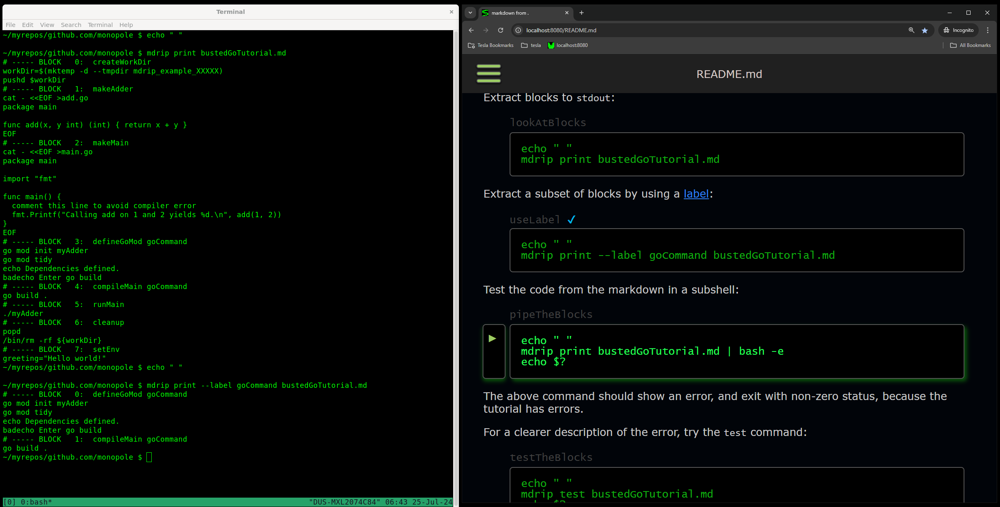

# mdrip

[_here_ documents]: http://tldp.org/LDP/abs/html/here-docs.html
[busted Go tutorial]: assets/bustedGoTutorial.md
[raw]: https://github.com/monopole/mdrip/blob/master/assets/bustedGoTutorial.md?plain=1
[travis-mdrip]: https://travis-ci.org/monopole/mdrip
[`tmux`]: https://github.com/tmux/tmux/wiki
[fenced code blocks]: https://help.github.com/articles/creating-and-highlighting-code-blocks/#fenced-code-blocks
[block quote]: https://github.github.com/gfm/#block-quotes
[label]: #labels
[labels]: #labels
[installation options]: ./assets/INSTALL.md
[Install `mdrip`]: ./assets/INSTALL.md

<!-- [](https://travis-ci.org/monopole/mdrip) -->
[](https://goreportcard.com/report/github.com/monopole/mdrip/v2)


`mdrip` is a tool for markdown-based [literate programming](#literate-programming).

* It allows one to place your fenced code blocks under test.

* It serves a keyboard-driven app with the rendered markdown to a browser,
  allowing one to navigate through the blocks and send them directly
  to [`tmux`] for execution.

See [installation options].

<a href="assets/mdripDemo.png" target="_blank">

</a>

## Use it for Testing

Use `mdrip` to assure that your markdown-based instructions
actually work.

To quickly demo this, use the following commands to
download a [busted Go tutorial]:

<!-- @downloadBusted -->
```shell
repo=https://raw.githubusercontent.com/monopole/mdrip
curl -O $repo/master/assets/bustedGoTutorial.md
```

This markdown has code blocks showing how to write, compile
and run a Go program in your `TMPDIR`.

[Install `mdrip`], then extract blocks to `stdout`:

<!-- @lookAtBlocks -->
```shell
mdrip print bustedGoTutorial.md
```

Some code blocks in this markdown have [labels]; these are visible as
HTML comments preceding the blocks in the [raw] markdown.

Use a label to extract a subset of blocks:
<!-- @useLabel -->
```shell
mdrip print --label goCommand bustedGoTutorial.md
```

Pipe the output of the above into `/bin/bash -e` to have the effect of a test,
or for cleaner output try the `test` command:

<!-- @testTheBlocks @skip -->
```shell
mdrip test bustedGoTutorial.md
echo $?
```

The above command should show an error, and exit with non-zero status,
because the tutorial has errors.

Fix the error:

<!-- @copyTheTutorial -->
```shell
cp bustedGoTutorial.md goTutorial.md
```

<!-- @fixError1 -->
```shell
sed -i 's|badecho |echo |' goTutorial.md
```

Try the fix:

<!-- @tryFix1 @skip -->
```shell
mdrip test goTutorial.md
echo $?
```

There's another error.  Fix it:

<!-- @fixError2 -->
```shell
sed -i 's|comment this|// comment this|' goTutorial.md
```

There are now two changes:

<!-- @observeDiffs -->
```shell
diff bustedGoTutorial.md goTutorial.md || echo files differ
```

Test the new file:

<!-- @testAgain -->
```shell
mdrip test goTutorial.md
echo $?
```

The return code should be zero.

You can run a block in your _current_ shell to, say, set
current environment variables as specified in the markdown:

<!-- @evalInShell -->
```shell
eval "$(mdrip print --label setEnv goTutorial.md)"
echo $greeting
```

The upshot is that adding a line like

> ```shell
> mdrip test --label {someLabel} {path}
> ```

to your CI/CD test framework covers
the markdown code block execution path determined by that label.


The `{path}` argument defaults to your current directory (`.`),
but it can be

* a path to a file,
* a path to a directory,
* a GitHub URL in the style `gh:{user}/{repoName}`,
* or a particular file or a directory in the
  repo, e.g. `gh:{user}/{repoName}/foo/bar`.

### Labels

Add _labels_ to a code block by preceding the block
with a one-line HTML comment, e.g:

<blockquote>
<pre>
&lt;&#33;-- @sayHello @mississippi @tutorial01 --&gt;
&#96;&#96;&#96;shell
echo hello
&#96;&#96;&#96;
</pre>
</blockquote>

Labels are just words beginning with `@` in the comment.

The first label on a block is slightly special in that it
is treated as the block's _name_ for reporting.
If no labels are present, a block name is generated.

A `@skip` label tells `mdrip` to ignore the block
for testing.

## Use it for Tutorials

`mdrip` works with [`tmux`] to help develop and run
command line procedures.

Generate some markdown content with:
<!-- @createTestData -->
```shell
tmpdir=$(mktemp -d)
mdrip generatetestdata ${tmpdir}/mdTestData
```

then enter `tmux`, and start a server:
<!-- @serveTestData @skip -->
```shell
tmux
mdrip serve ${tmpdir}/mdTestData &
```
Visit [localhost](http://localhost:8080).

-  `j` and `k` move among blocks

-  `Enter` sends the current block to `tmux`

-  `?` shows all key controls


## Literate Programming

[_literate programming_]: http://en.wikipedia.org/wiki/Literate_programming

`mdrip` encourages [_literate programming_] via markdown.
It lets one run code that is embedded in explanatory content.

One can use [_here_ documents] to incorporate any programming
language into tested markdown - as in the [busted Go tutorial]
discussed above.  That tutorial could have covered C, C++, Rust, etc.

Place commands that the reader would want to execute directly
(with no edits) in [fenced code blocks].

In contrast, code-style text that is not intended for copy/paste execution,
e.g. alternative commands with fake arguments or example output,
should be in a fenced code block indented via a
[block quote]. Block quotes are ignored by `mdrip`.
